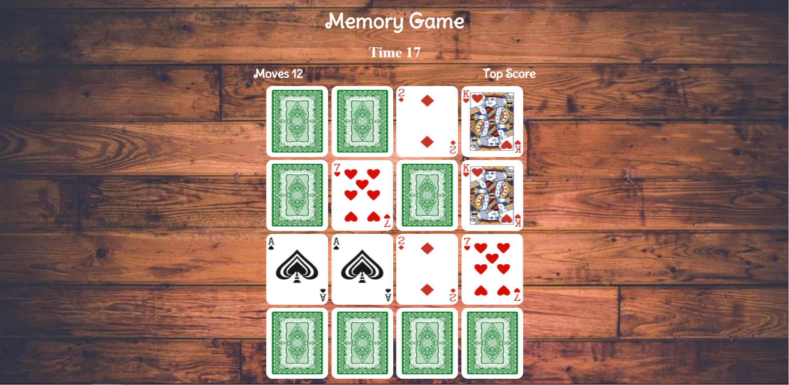

# React Memory Game

## How does the code work ?
*gameOver( )* activates if the game isn't won in 60 seconds.

state *topScore* checks local storage for any previous topscores.

clicking a card activates *handleClick( )* which checks if  *flippedcards[ ]* includes the card (if the card is already flipped). if not, *flipCard( )* activates. the card stays flipped. 

*flipCard( )* adds the card to *flippedcards[ ]*. if the array length reaches 2(if a second card is flipped), *check( )* activates. state *freezeBoard* prevents more card flips untill *check( )* is done(0.5 second).also state *moves* increases by 1.

*check( )* compares the cards inside *flippedcards[ ]*. if their names match, it'll be added to *matchedCards[ ]*. if not,they flip back.

updating *matchedCards[ ]* activates *vicoryCheck( )*, which checks if *matchedCards[ ]*'s length is the number of total cards. if yes the game is won. if there's a new *topScore*(lowest number of moves) it will be saved in local storage.
the interval for *timer* is cleared.

*handleRestart( )* resets all states to initial values , so the cards are flipped back and shuffled. it also sets a new interval for the timer.

## CSS Challenges

preventing the cards from stretching on diffrent screen sizes.  

solution: keeping a fixed resolution on the game board along with max-width and max-height.  

.game-container {  
width: 90vw;  
height: calc(90vw * 1.14);  
max-height: 467px;  
max-width: 410px;   
}

for tablets: 

@media screen and (min-width: 700px)and (min-height:1000px) {  
 .game-container{  
  max-height: 700.5px;  
  max-width: 615px;  
 }

